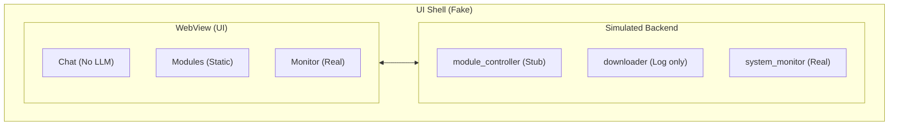

## Обзор

Flux Platform — десктопное приложение на **Tauri v2** + **Rust** + **Vite**.



---

## Архитектурные принципы

> Эти правила предотвращают архитектурный дрейф со временем.

| Правило                               | Пояснение                                                                   |
| ------------------------------------- | --------------------------------------------------------------------------- |
| **Вся бизнес-логика — только в Rust** | Frontend не содержит вычислений (но содержит много UI-логики)               |
| **IPC команды — Pass-through**        | `commands/` часто просто пробрасывают вызовы без глубокой валидации         |
| **services/ не знают о Tauri**        | Соблюдается (сервисы изолированы)                                           |
| **Frontend — Monolithic Vanilla JS**  | Логика сконцентрирована в крупных файлах (`chat.js`), ручное управление DOM |
| **Event-driven**                      | Используется для мониторинга, но реализация местами смешана                 |

---

## Безопасность

> [!WARNING]
> Frontend считается **недоверенной средой**, но текущая реализация валидации на бэкенде **неполная**.
> Лицензирование и защита реализованы на базовом уровне (Stubs) и легко обходятся.

| Аспект                 | Реализация (v1.0)                                              |
| ---------------------- | -------------------------------------------------------------- |
| **Лицензирование**     | **Weak / Stub**. Проверка префикса ключа, нет онлайн-валидации |
| **Критичные операции** | Выполняются в backend, но проверка прав доступа минимальна     |
| **Валидация**          | Частичная. Некоторые команды доверяют входным данным (`id`)    |
| **Секреты**            | В целом скрыты, но возможны утечки URL (см. `core.js`)         |

---

## Структура Backend

```
src-tauri/src/
├── commands/ # IPC слой (тонкий!)
│ ├── downloader.rs
│ ├── health.rs
│ ├── license.rs
│ ├── logs.rs
│ ├── modules.rs
│ ├── settings.rs
│ ├── system.rs
│ ├── theme.rs
│ ├── translations.rs
│ ├── window.rs
│ ├── window_settings.rs
│ └── mod.rs
│
├── services/ # Бизнес-логика
│ ├── license/
│ ├── logs.rs
│ ├── module_controller.rs
│ ├── module_lifecycle.rs
│ ├── settings.rs
│ ├── system_monitor.rs
│ ├── theme.rs
│ ├── translations.rs
│ ├── window_settings.rs
│ └── mod.rs
│
├── models/ # DTO (Data Transfer Objects)
├── utils/ # Хелперы
│ ├── paths.rs
│ ├── process.rs
│ ├── windows.rs
│ └── mod.rs
├── errors.rs
├── lib.rs
├── main.rs
└── tests.rs
```

---

## Data Transfer Objects (DTO)

> Все данные между UI и backend передаются только через `models/`

| Правило                            | Пояснение                                    |
| ---------------------------------- | -------------------------------------------- |
| UI не получает внутренних структур | Сервисы возвращают DTO, не internal types    |
| Изменения в DTO = breaking change  | Версионируем при изменении API               |
| Ошибки через `IpcError`            | Структурированный формат `{ code, message }` |

---

## Error Model

```rust
pub enum AppError {
    Validation(String),      // Ошибка валидации входных данных
    NotFound(String),        // Ресурс не найден
    PermissionDenied(String), // Нет доступа / лицензия
    Config(String),          // Ошибка конфигурации
    External(String),        // Внешний сервис недоступен
    Internal(String),        // Внутренняя ошибка
}
```

**Правила:**

-   `services/` возвращают `Result<T, AppError>`
-   `commands/` мапят `AppError` → `IpcError` для UI
-   UI получает `{ code: "VALIDATION", message: "..." }`

---

```rust
// commands/downloader.rs (Actual Implementation)
#[tauri::command]
pub fn start_download(id: String) {
    // ⚠️ Validation is missing here in v1.0
    downloader::start(&id);
}
```

> [!NOTE]
> В текущей версии многие команды нарушают принцип "Validation in Commands" и сразу вызывают сервис.

---

## Модули (Lifecycle)

Каждый модуль поддерживает lifecycle:

| Фаза           | Описание                                |
| -------------- | --------------------------------------- |
| `init`         | Первичная инициализация при регистрации |
| `start`        | Запуск модуля                           |
| `stop`         | Graceful остановка                      |
| `dispose`      | Очистка при удалении                    |
| `health_check` | Проверка состояния                      |

### Манифест модуля (module.json):

```json
{
    "apiVersion": "1",
    "id": "flux-chat",
    "name": "Flux Chat",
    "version": "1.0.0",
    "entry": "main.exe",
    "dependencies": ["python-3.11"],
    "lifecycle": {
        "init": "scripts/init.ps1",
        "start": "start.bat",
        "stop": "stop.bat"
    }
}
```

> [!NOTE] > `apiVersion` используется для проверки совместимости.
> При изменении API модулей увеличивайте версию.

---

## Тестирование и Качество кода

| Слой           | Текущее состояние (Reality)           |
| -------------- | ------------------------------------- |
| **services/**  | Частичное покрытие Unit-тестами       |
| **Frontend**   | **Нет тестов**. Ручное тестирование   |
| **Code Style** | Смешанный. Frontend - legacy style JS |

> [!CRITICAL]
> Frontend (`src/js/`) страдает от отсутствия модульности (God Objects) и загрязнения глобальной области видимости (`window.*`).
> Рефакторинг `chat.js` (2000+ строк) имеет высокий приоритет.

---

## IPC Команды

| Команда              | Сервис              | Описание                |
| -------------------- | ------------------- | ----------------------- |
| `get_system_stats`   | `system_monitor`    | CPU, RAM, Disk, Network |
| `get_modules`        | `modules`           | Список модулей          |
| `control_module`     | `module_controller` | Start/stop/install      |
| `get_license_status` | `license::verifier` | Статус лицензии         |
| `get_settings`       | `settings`          | Настройки пользователя  |

---

## События (Events)

Вместо polling UI подписывается на события:

| Событие             | Источник         | Данные                         |
| ------------------- | ---------------- | ------------------------------ |
| `system_stats`      | `system_monitor` | `SystemStats` (каждую секунду) |
| `download_progress` | `downloader`     | `{ id, progress, status }`     |

### Управление мониторингом

```rust
// Запуск мониторинга (вызывается в setup)
services::system_monitor::start_monitoring(app.handle().clone(), 1000);

// Остановка мониторинга (при закрытии приложения)
services::system_monitor::stop_monitoring();
```

### Правила именования

| Правило                     | Пример                              |
| --------------------------- | ----------------------------------- |
| События в `snake_case`      | `system_stats`, `download_progress` |
| Payload только из `models/` | Не internal structs                 |
| Event = публичный API       | Изменение = breaking change         |

```javascript
// Frontend подписка
import { listen } from "@tauri-apps/api/event";

const unlisten = await listen("system_stats", (event) => {
    updateUI(event.payload);
});
```

---

## Windows Specific Features

Flux Platform включает ряд оптимизаций для Windows:

1.  **System Tray**:

    -   Реализован через `TrayIconBuilder` c иконкой приложения.
    -   Контекстное меню: "Показать" (Show) и "Выход" (Quit).
    -   Двойной клик открывает главное окно.
    -   При выходе происходит корректная остановка мониторинга (`system_monitor::stop_monitoring`).

2.  **Language Detection**:

    -   Использует Win32 API (`GetUserDefaultUILanguage`) через crate `windows-sys`.
    -   Автоматически определяет язык системы при первом запуске (fallback на `en`).

3.  **Window Persistence**:
    -   Сохраняет состояние окна (размер, позиция, maximized) и уровень зума.
    -   Конфиг: `AppData/Roaming/.../window-settings.json`.
    -   Логика восстановления работает на старте приложения до показа окна.
